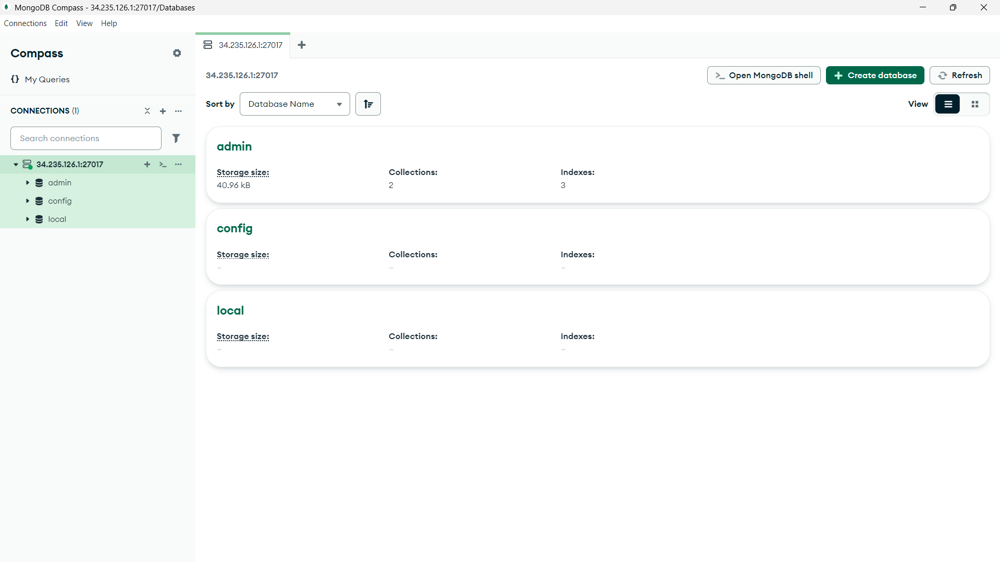
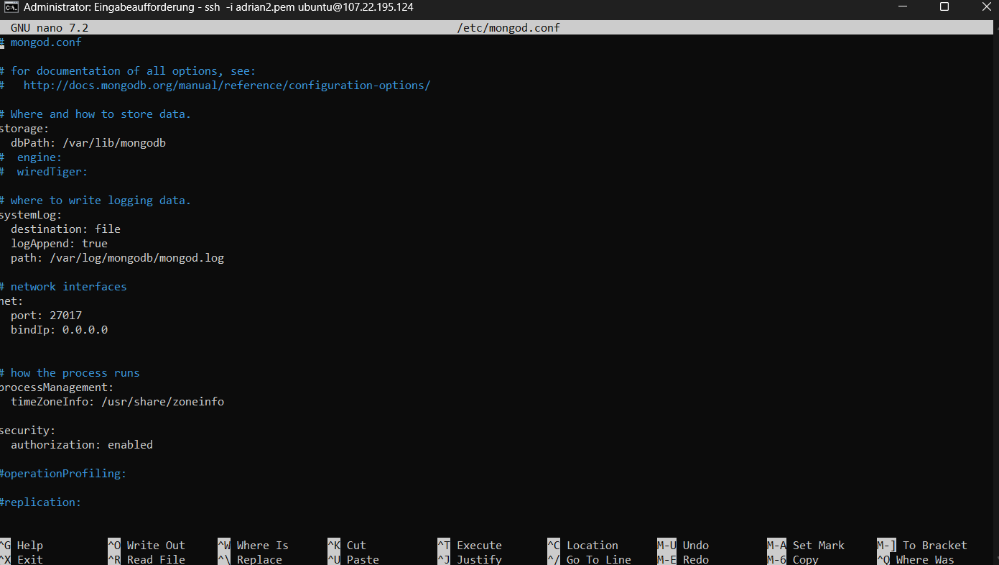
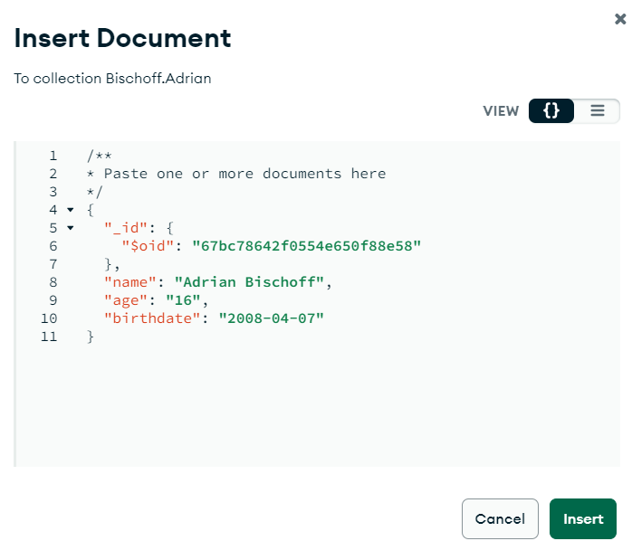
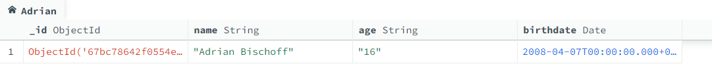
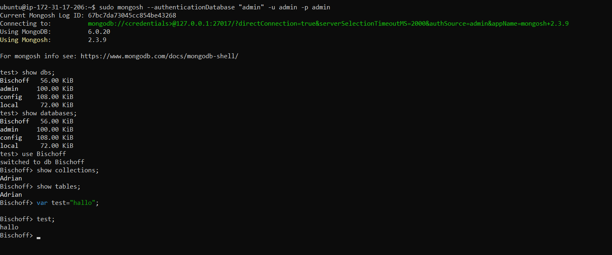

# Aufgabe A

## Cloud Init: [CloudInit](cloudinit-mongodb.yaml)

## authSource=admin

Der User verbindet sich mit der Admin Datenbank. Dies wird so gemacht, weil die Admin Datenbank als standart Authentifizierungsdatenbank verwendet wird.

## Sed Befehle

### sudo sed -i 's/127.0.0.1/0.0.0.0/g' /etc/mongod.conf
Dieser Befehl ersetzt die Adresse von 127.0.0.1 (nur lokale Verbindungen) auf 0.0.0.0, sodass MongoDB von allen IPs erreichbar ist.

### sudo sed -i 's/#security:/security:\n  authorization: enabled/g' /etc/mongod.conf

Dieser Befehl aktiviert die Authentifizierung. Das wird gemacht, dass nur autorisierte Benutzer zugreifen können.

## Konfigurations-Datei Änderungen

# Aufgabe B

## Export: [json](Bischoff.Adrian.json)

## Erklärung Datentyp

Weil in Json nur primitive Datentypen gebraucht werden können muss man ein Objekt machen und dort $date angeben.

# Aufgabe C

## Befehle 1-5

1. **`show dbs;`**: Zeigt alle verfügbaren Datenbanken an.
2. **`show databases;`**: Zeigt alle verfügbaren Datenbanken an.
3. **`use Ihre-Datenbank;`**: Wechselt zur angegebenen Datenbank
4. **`show collections;`**: Zeigt alle Collections in der aktuell ausgewählten MongoDB-Datenbank an.
5. **`show tables;`**: Zeigt alle Tabellen in der aktuell ausgewählten MySQL-Datenbank an.

## Unterschied zwischen Collections und Tables:
- **Collections:** flexible Datentypen, die Elemente in einer nicht strukturierten oder ungeordneten Weise speichern.
- **Tables:** Strukturierte Datenspeicherung mit festen Schemata, in relationalen Datenbanken