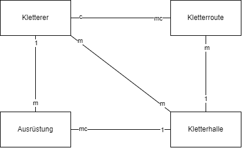
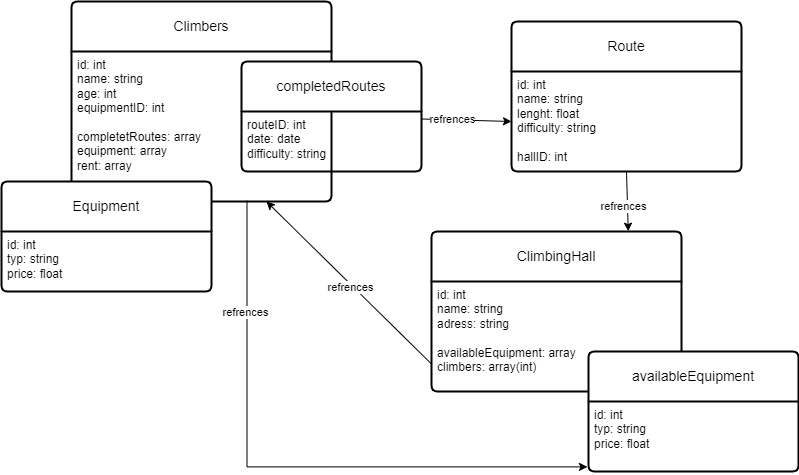

# Aufgabe A

## [Konzeptionelles Datenmodell](KN-M-02_A.drawio)

## Erklärung

- Der Kletterer hat mehrere Ausrüstungen
- Die Ausrüstung gehört einem Kletterer
- Der Kletterer geht in mehrere Kletterhallen
- Die Kletterhalle hat mehrere Kletterer
- Der Kletterer macht keine oder mehrere Routen
- Eine Route wird von einem Kletterer gemacht
- Die Kletterhalle hat mehrere Routen
- Die Kletterroute is in einer Kletterhalle
- Die Kletterhalle hat mehrere oder keine Ausrüstungen
- Die Ausrüstung gehört einer Kletterhalle

# Aufgabe B

## [Logisches Modell](KN-M-02_B.drawio)

## Erklärung

Ich habe diese Methode genommen, weil ich sie am übersichtlichsten finde.
Es ist schnell klar wie die Entitäten verwandt sind.

# Aufgabe C

## [Climbing.js](Climbing.js)