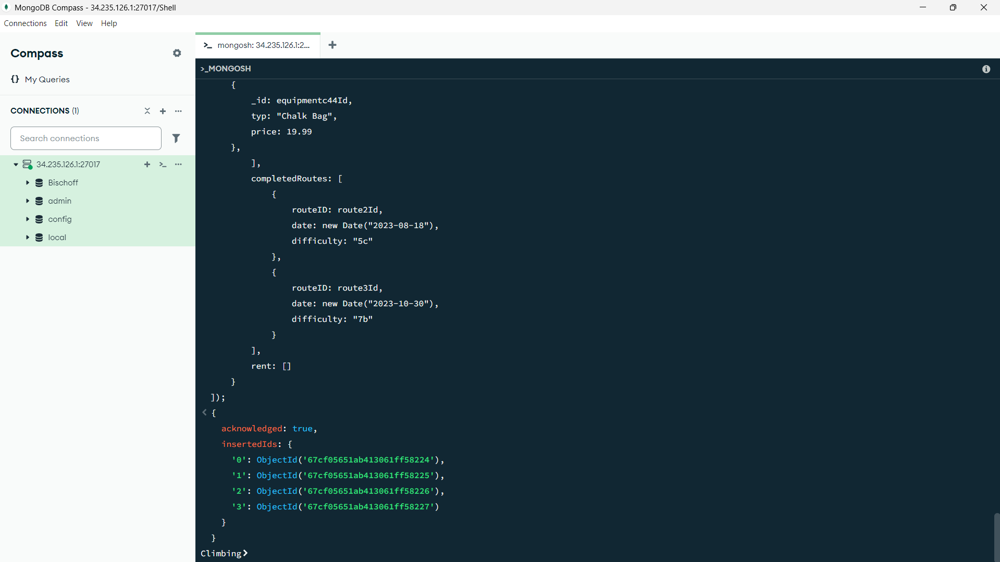
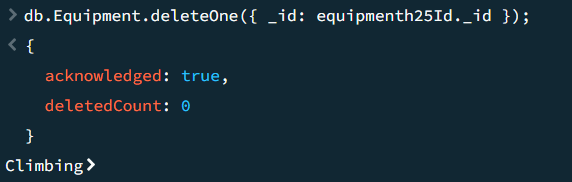
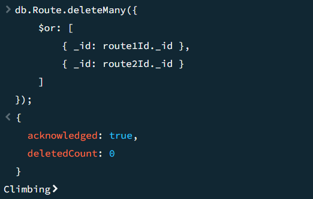
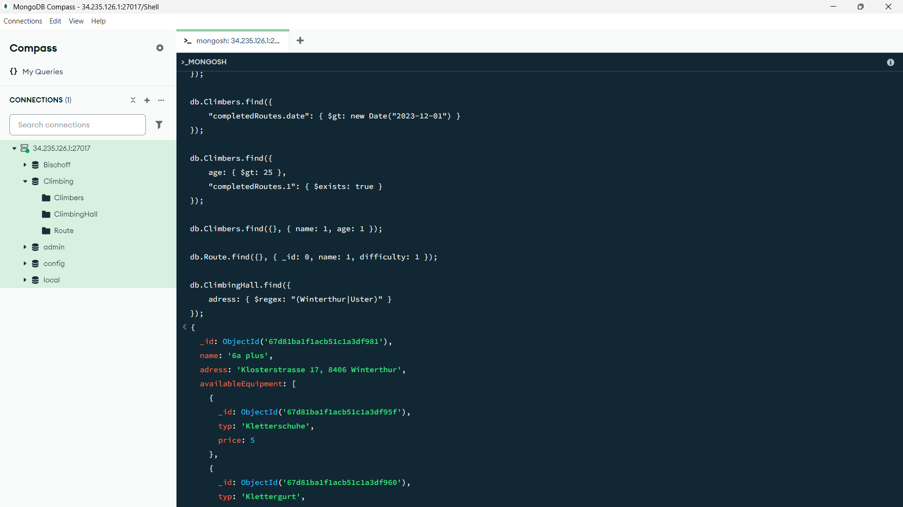
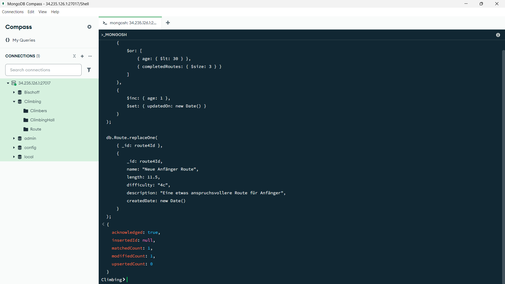

# Aufgabe A

## [Climbing.js](climbing.js)



# Aufgabe B

## Alle Collections löschten
```
db.Route.drop();
db.ClimbingHall.drop();
db.Climbers.drop();
```

## Daten teilweise löschten
```
db.Equipment.deleteOne({ _id: equipment1._id });

db.Route.deleteMany({
    $or: [
        { _id: route1._id },
        { _id: route2._id }
    ]
});
```




# Aufgabe C

## [Find.js](find.js)


# Aufgabe D

## [Update.js](update.js)
