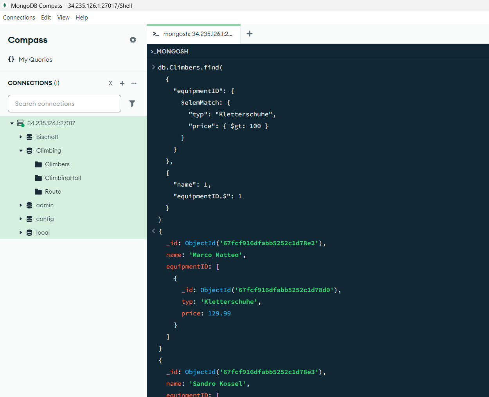

# Aufgabe A

## $match
```
db.Route.aggregate([
  { $match: { length: { $gte: 12 } } },
  { $match: { length: { $lte: 16 } } }
]);
```


## $match, $project, $sort

```
db.Climbers.aggregate([
  { $match: { age: { $gt: 25 } } },
  { $project: { _id: 0, name: 1, age: 1 } },
  { $sort: { age: 1 } }
]);
```


## $sum

```
db.Climbers.aggregate([
  { 
    $group: { 
      _id: "$age",
      count: { $sum: 1 }
    } 
  }
]);
```


## $group

```
db.Route.aggregate([
  { 
    $group: { 
      _id: "$difficulty",
      avgLength: { $avg: "$length" }
    } 
  }
]);

```	


# Aufgabe B

## join

```
db.Route.aggregate([
  {
    $lookup: {
      from: "ClimbingHall",
      localField: "hallID",
      foreignField: "_id",
      as: "hallDetails"
    }
  },
  {
    $project: {
      _id: 1,
      name: 1,
      length: 1,
      difficulty: 1,
      "hallDetails.name": 1,
      "hallDetails.adress": 1
    }
  }
])
```


## $lookup

```
db.Climbers.aggregate([
  {
    $lookup: {
      from: "Route",
      localField: "completedRoutes.routeID",
      foreignField: "_id",
      as: "routenDetails"
    }
  },
  {
    $match: {
      "routenDetails.difficulty": { $gte: "6a+" }
    }
  },
  {
    $addFields: {
      "anzahlRouten": { $size: "$routenDetails" },
      "gesamtKletterlänge": { $sum: "$routenDetails.length" }
    }
  },
  {
    $project: {
      "name": 1,
      "age": 1,
      "anzahlRouten": 1,
      "gesamtKletterlänge": 1,
      "schwierigsteRoute": { $max: "$routenDetails.difficulty" }
    }
  },
  {
    $sort: { "gesamtKletterlänge": -1 }
  }
])
```


# Aufgabe C

## Einzelne Felder der Unterdokumente
```
db.Climbers.find({}, 
  { 
    "name": 1, 
    "equipmentID.typ": 1, 
    "equipmentID.price": 1,
    "_id": 0 
  }
)
```


## Unterdokumente filtern

```	
db.Climbers.find(
  { 
    "equipmentID": { 
      $elemMatch: { 
        "typ": "Kletterschuhe", 
        "price": { $gt: 100 } 
      } 
    } 
  },
  {
    "name": 1,
    "equipmentID.$": 1
  }
)
```




## $unwind

```
db.Climbers.aggregate([
  { $unwind: "$completedRoutes" },
  { 
    $project: { 
      "name": 1, 
      "route": "$completedRoutes.routeID", 
      "datum": "$completedRoutes.date", 
      "schwierigkeit": "$completedRoutes.difficulty" 
    } 
  }
])
```

