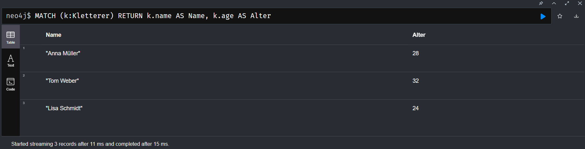
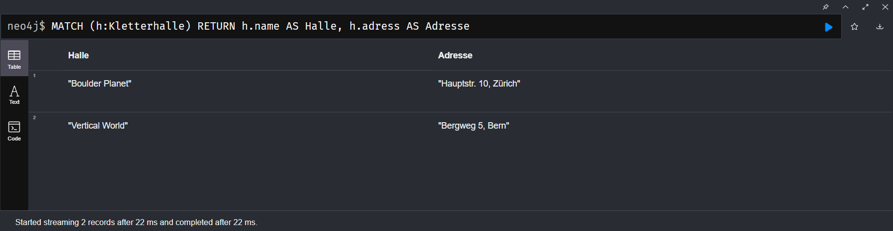

# Aufgabe A

[insert.txt](insert.txt)


# Aufgabe B

```	
MATCH (n) OPTIONAL MATCH (n)-[r]->(m) RETURN n, r, m
```
Nach dem Match in der Klammer kommt die Bedingung. Dort ist keine Bedingung, die Ausgabe wird in der Variable n gespeichert. (n)-[r]-(m) sucht nach ausgehenden Verbindungen, wenn keine gefunden werden wird n trotzdem zurückgegeben, wegen dem Optional.

## Alle Kletterer anzeigen
```
MATCH (k:Kletterer) RETURN k.name AS Name, k.age AS Alter  
```


## Alle Kletterhallen anzeigen
```
MATCH (h:Kletterhalle) RETURN h.name AS Halle, h.adress AS Adresse  
```


## Ausrüstungstypen anzeigen
```	
MATCH (a:Ausrüstung) RETURN a.typ AS Ausrüstung, a.price AS Preis  
```


## Kletterrouten mit Schwirigkeitsgrad anzeigen
```
MATCH (r:Kletterroute) RETURN r.name AS Route, r.schwierigkeit AS Schwierigkeit  
```


# Aufgabe C

## Delete ohne Detatch
```	
MATCH (k:Kletterer {id: 1})
DELETE k
```	

Kann nicht gelöscht werden, weil der Kletterer noch Verbindungen hat

## Delete mit Detatch
```	
MATCH (k:Kletterer {id: 2})
DETACH DELETE k
```

Wird erfolgreich ausgeführt, weil der Kletterer mit allen Beziehungen gelöscht wird.

# Aufgabe D

## Szenario 1: Schwierigkeitsgrad einer Kletterroute aktualisieren
Beschreibung: Die Route "Drachenwand" schwieriger machen

```	
MATCH (r:Kletterroute {name: "Drachenwand"}) 
SET r.schwierigkeit = "6b" 
RETURN r.name, r.schwierigkeit
```


## Szenario 2: Ausleihpreis für alle Kletterschuhe erhöhen
Beschreibung: Leihgebühren für Kletterschuhe um 20% erhöhen

```
MATCH (a:Ausrüstung WHERE a.typ = "Kletterschuhe")
SET a.price = a.price * 1.2
RETURN a.typ, a.price AS neuer_preis
```


## Szenario 3: Alter aller Kletterer erhöhen
Beschreibung: Alle Kletterer um 1 Jahr älter machen

```
MATCH (k:Kletterer)
SET k.age = k.age + 1
RETURN k.name, k.age AS neues_alter
```


# Aufgabe E

## ORDER BY
- Die Abfrage findet alle Kletterer in der Datenbank
- Für jeden Kletterer werden Name und Alter zurückgegeben
- Das Ergebnis wird nach dem Alter in aufsteigender Reihenfolge sortiert (vom jüngsten zum ältesten)
``` 
MATCH (k:Kletterer)
RETURN k.name AS KlettererName, k.age AS Alter
ORDER BY k.age ASC
```


## LIMIT
- Die Abfrage findet alle Kletterrouten in der Datenbank
- Für jede Route werden Name und Schwierigkeitsgrad zurückgegeben
- Durch LIMIT 2 werden nur die ersten zwei Ergebnisse angezeigt

```
MATCH (r:Kletterroute)
RETURN r.name AS RoutenName, r.schwierigkeit AS Schwierigkeitsgrad
LIMIT 2
```	
