# Aufgabe A

[insert.txt](insert.txt)

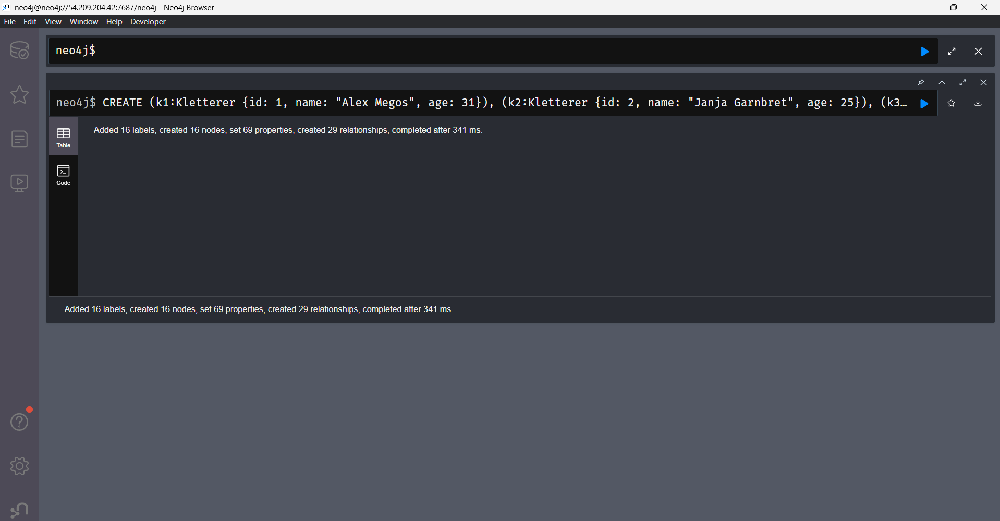

# Aufgabe B

```	
MATCH (n) OPTIONAL MATCH (n)-[r]->(m) RETURN n, r, m
```
Nach dem Match in der Klammer kommt die Bedingung. Dort ist keine Bedingung, die Ausgabe wird in der Variable n gespeichert. (n)-[r]-(m) sucht nach ausgehenden Verbindungen, wenn keine gefunden werden wird n trotzdem zurückgegeben, wegen dem Optional.

## Finde Routen der Schwierigkeit 9a oder höher.

```
MATCH (r:Kletterroute)
WHERE r.difficulty >= "9a"
RETURN r.name, r.difficulty;
```
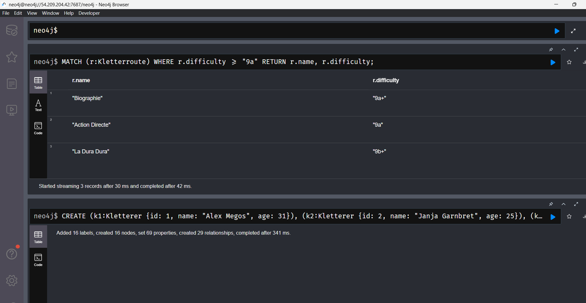

## Zeige, welche Ausrüstung jeder Kletterer besitzt.

```
MATCH (k:Kletterer)-[:HAT_AUSRÜSTUNG]->(a:Ausrüstung)
RETURN k.name AS Kletterer, a.typ AS Ausrüstung;
```
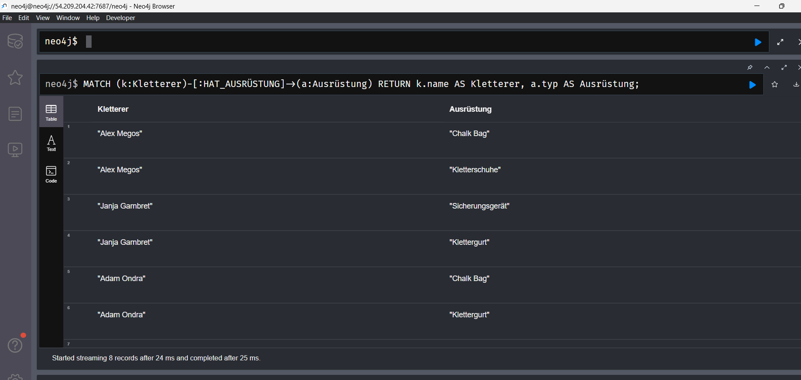

## Zeige alle Kletterhallen und wer sie besucht.

```
MATCH (h:Kletterhalle)
OPTIONAL MATCH (k:Kletterer)-[:KLETTERT_IN]->(h)
RETURN h.name AS Halle, COLLECT(k.name) AS Besucher;
```
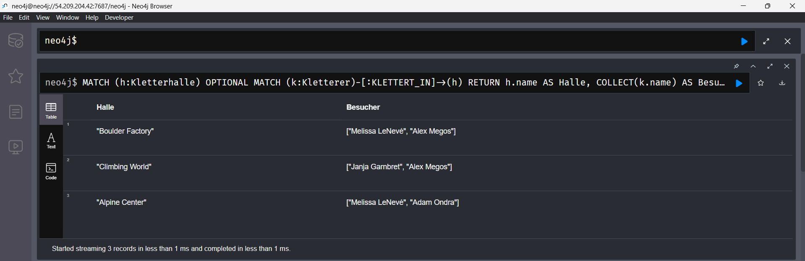

## Finde Kletterer unter 30 und welche Routen sie klettern.

```
MATCH (k:Kletterer)
WHERE k.age < 30
OPTIONAL MATCH (k)-[:WIRD_GEKLETTERT_VON]->(r:Kletterroute)
RETURN k.name, k.age, COLLECT(r.name) AS Routen;
```
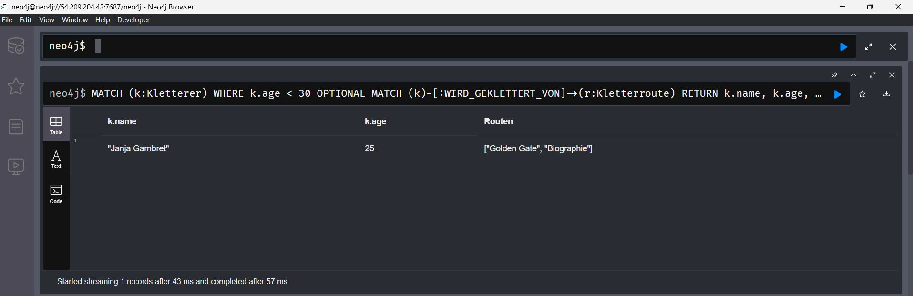

# Aufgabe C

## Delete ohne Detatch
```	
MATCH (k:Kletterer {id: 1})
DELETE k
```	
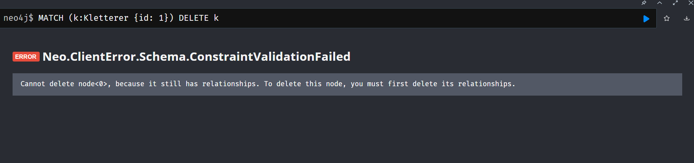
Kann nicht gelöscht werden, weil der Kletterer noch Verbindungen hat

## Delete mit Detatch
```	
MATCH (k:Kletterer {id: 2})
DETACH DELETE k
```
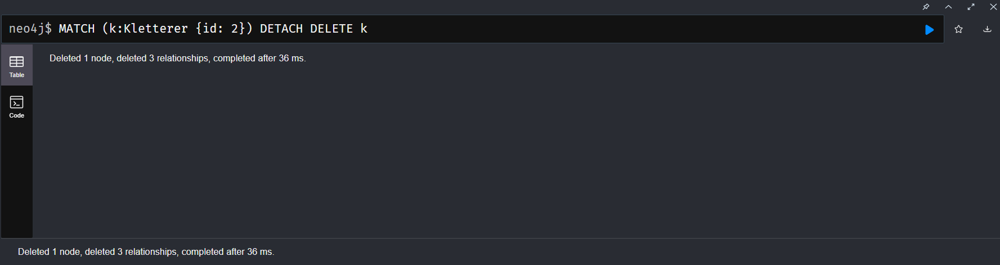
Wird erfolgreich ausgeführt, weil der Kletterer mit allen Beziehungen gelöscht wird.

# Aufgabe D

## Szenario 1: Aktualisierung der Schwierigkeitsbewertung
```
MATCH (r:Kletterroute {name: "Biographie"})  
SET r.legit = 9.3, r.difficulty = "9b"  
RETURN r;
```
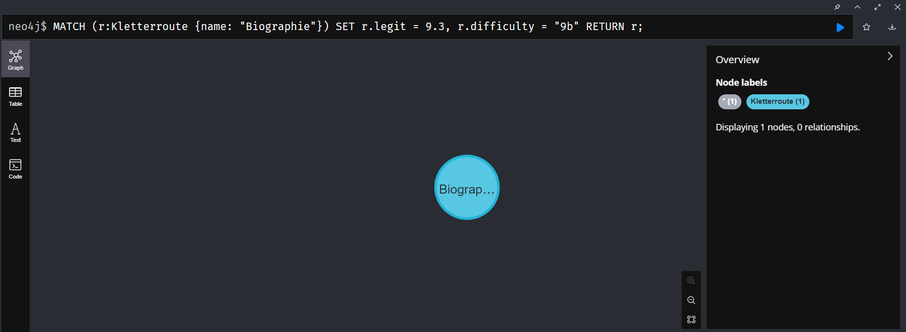

## Szenario 2: Wechsel der Kletterhalle für eine Route

```
MATCH (r:Kletterroute {name: "Rainbow Rocket"})-[old:BEFINDET_SICH_IN]->(h1:Kletterhalle {name: "Boulder Factory"})  
MATCH (h2:Kletterhalle {name: "Climbing World"})  
DELETE old  
CREATE (r)-[:BEFINDET_SICH_IN]->(h2)  
RETURN r, h2;

```
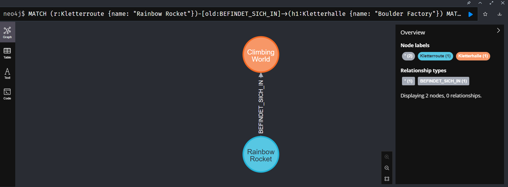

## Szenario 3: Korrektur der Ausrüstungsvermietung

```
MATCH (a:Ausrüstung {id: 202})-[v:VERMIETET]->(h1:Kletterhalle {name: "Boulder Factory"})  
MATCH (h2:Kletterhalle {name: "Climbing World"})  
DELETE v  
CREATE (a)-[:VERMIETET {vermietet_am: "2023-03-01"}]->(h2)  
RETURN a, h2;
```
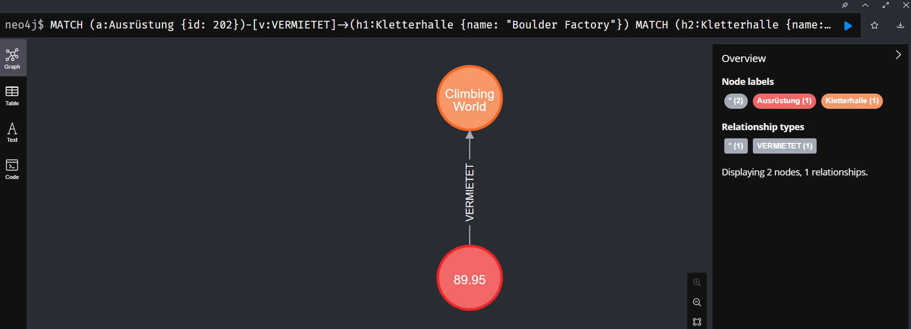

# Aufgabe E

## ORDER BY
- Die Abfrage findet alle Kletterer in der Datenbank
- Für jeden Kletterer werden Name und Alter zurückgegeben
- Das Ergebnis wird nach dem Alter in aufsteigender Reihenfolge sortiert (vom jüngsten zum ältesten)
``` 
MATCH (k:Kletterer)
RETURN k.name AS KlettererName, k.age AS Alter
ORDER BY k.age ASC
```
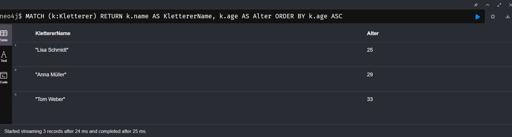

## LIMIT
- Die Abfrage findet alle Kletterrouten in der Datenbank
- Für jede Route werden Name und Schwierigkeitsgrad zurückgegeben
- Durch LIMIT 2 werden nur die ersten zwei Ergebnisse angezeigt

```
MATCH (r:Kletterroute)
RETURN r.name AS RoutenName, r.schwierigkeit AS Schwierigkeitsgrad
LIMIT 2
```	
