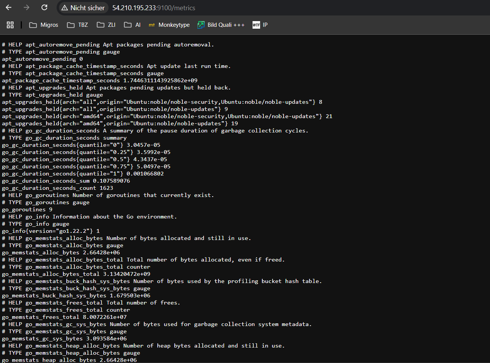
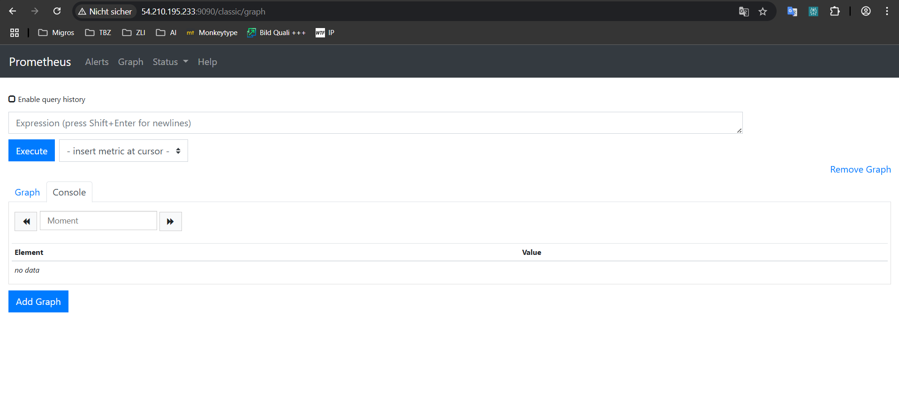
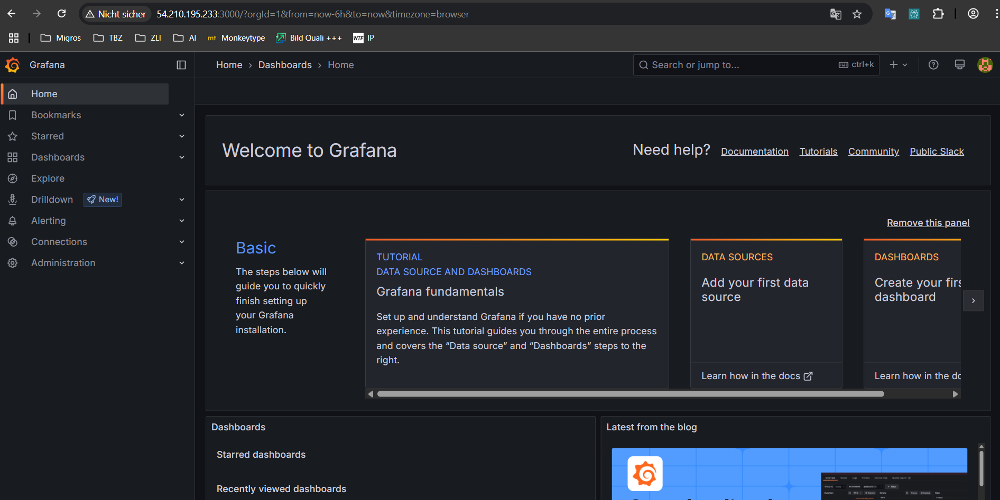
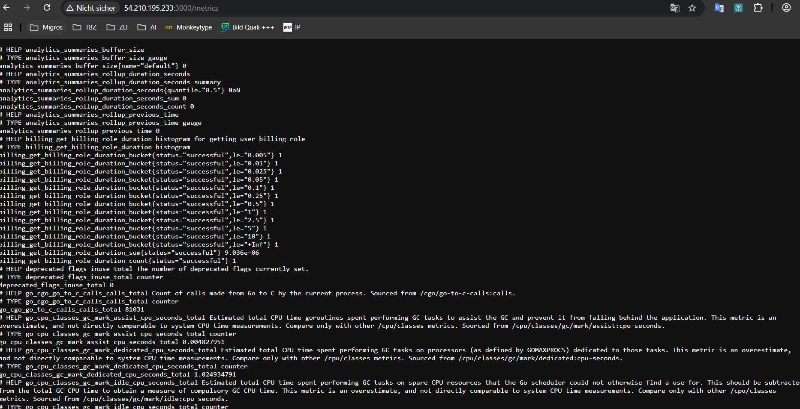

# Aufgabe A

## Prometheus Node-Exporter Metrics


## Prometheus Dashboard:


## Grafana Dashboard:


## Grafana Metrics für Prometheus



# Aufgabe B

## Was sind Scrapes?
Scrapes sind die Requests, die Prometheus an das überwachte System sendet, um dessen Status zu überprüfen Diese werden bei mir alle 15s an `localhost:9090` und `localhost:9100` gesendet

## Was sind Rules?
Rules in Prometheus sind vordefinierte Regeln, die entweder zur Aggregation von Metriken (Recording Rules) oder zur Generierung von Alerts (Alerting Rules) verwendet werden.
### Recording Rule

```
- record: node_memory_MemFree_percent
  expr: 100 - (100 * node_memory_MemFree_bytes / node_memory_MemTotal_bytes)
```
Diese Regel berechnet den prozentualen freien Speicher und speichert das Ergebnis als neue Metrik.

### Alerting Rule 
```
- alert: InstanceDown
  expr: up == 0
  for: 1m
```
Diese Regel löst einen Alarm aus, wenn ein Target (up == 0) für mehr als 1 Minute nicht erreichbar ist.

## Was sind die Schritte, die Sie als Programmierer ausführen müssen, um eigene Daten in Prometheus zu speichern?
- Prometheus installieren
- Konfigurieren damit etwas gescraped wird
- Optional Metriken visualisieren

## Welche Variablen werden verwendet in den Scrapes und Rules und von welchen Seiten/URLs kommen diese Variablen?

### Variablen in Scrapes

- `localhost:9090`: Stammt von Prometheus selbst.
- `localhost:9100`: Stammt vom `prometheus-node-exporter`, der Systemmetriken bereitstellt.

### Variablen in Rules

- `node_memory_MemFree_bytes` und `node_memory_MemTotal_bytes`: Werden vom `node-exporter` bereitgestellt.
- `up`: Interne Metrik von Prometheus, zeigt Erreichbarkeit eines Targets an (`1 = up`, `0 = down`).


## Wie weiss Prometheus, ob ein System up ist?

`up == 1`: Das Target ist erreichbar.

`up == 0`: Das Target ist nicht erreichbar.

Wenn ein Target nicht erreichbar ist (`up == 0`) und dieser Zustand länger als 1m anhält, wird der Alert InstanceDown ausgelöst.